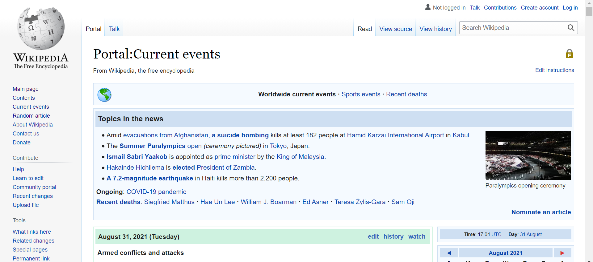
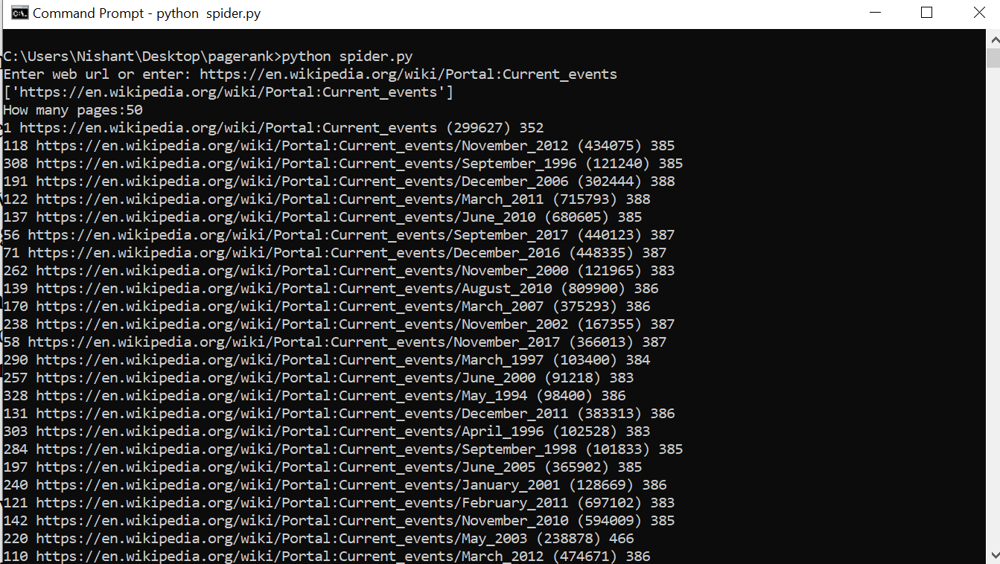
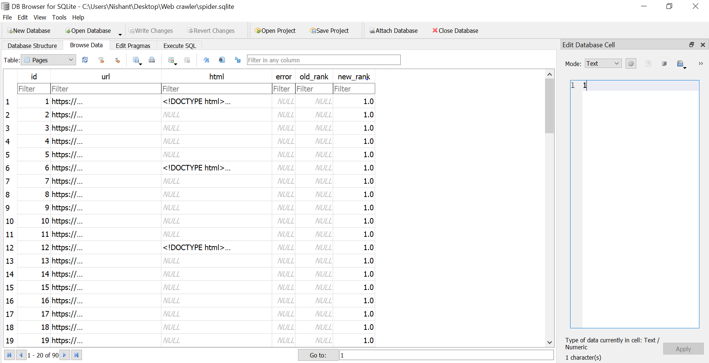

# Web-Crawler

## Objective

Simple Python Search Spider. This is a set of programs that emulate some of the functions of a search engine. They store their data in a SQLITE3 database named 'spider.sqlite'. This file can be removed at any time to restart the process.

## Environmental Prepartation For Web Crawling

1. Download and install Python
2. Download a suitable IDE(Integrated development environments)
3. Install the required Python packages 
Pip is a Python package management tool. It provides functions for searching, downloading, installing, and uninstalling Python packages. This tool will be included when downloading and installing Python. Therefore, we can directly use ‘pip install’ to install the libraries we need.
  * pip install beautifulsoup4
  * pip install lxml
  
    * BeautifulSoup is a library for easily parsing HTML and XML data.
    * lxml is a library to improve the parsing speed of XML files.

4. You should install the SQLite browser to view and modify the databases from [here](http://sqlitebrowser.org/) 

## The following is an example of using a crawler to crawl the WIKIPEDIA webpage.

## Extract Information

In this sample run, we told it to crawl a website and retrieve fifty pages. If you restart the program again and tell it to crawl more pages, it will not re-crawl any pages already in the database. Upon restart it goes to a random non-crawled page and starts there. So each successive run of spider.py is additive.

## Output 

The final weblink get stored into the SQLite3 database. The interface looks like:

